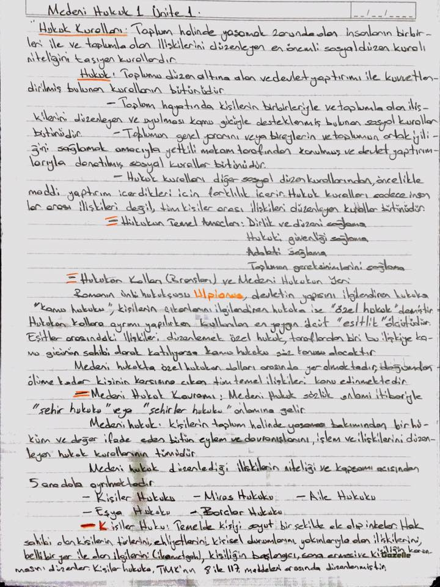
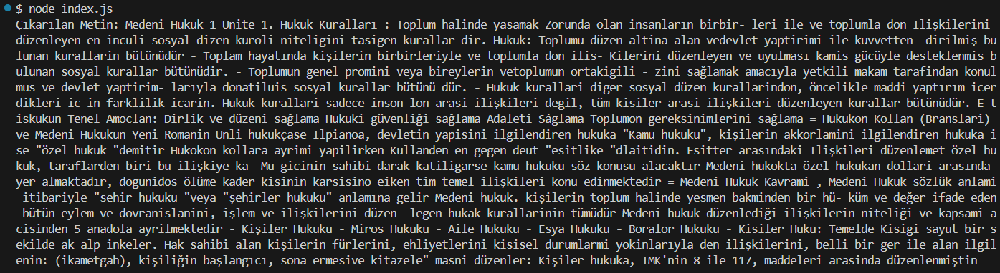

# Computer Vision ile Resimden Metin Çıkarma

Bu proje, Microsoft'un Computer Vision API'sini kullanarak bir görüntüden metin çıkarmayı amaçlayan bir Node.js uygulamasıdır. Resim dosyası ham verisi API'ye gönderilir ve API tarafından algılanan metinler konsol çıktısında gösterilir.

---

## Kurulum

1. Bu projeyi klonlayın:
    ```bash
    git clone https://github.com/HsynDmrl/Image-To-Text-Extraction.git
    ```

2. Proje dizinine gidin:
    ```bash
    cd Image-To-Text-Extraction
    ```

3. Gerekli bağımlılıkları yükleyin:
    ```bash
    npm install
    ```

4. `.env` dosyasını oluşturun ve `.env.example` dosyasındaki değişkenleri doldurun:
    ```plaintext
    COMPUTER_VISION_ENDPOINT=https://your-endpoint.cognitiveservices.azure.com/
    COMPUTER_VISION_API_KEY=your-api-key-here
    ```

5. Uygulamayı çalıştırın:
    ```bash
    node index.js
    ```

---

## Girdi ve Çıktı Örneği

### Kullanılan Resim:
Proje içinde yer alan örnek resim dosyası: `notes.jpg`



### Program Çıktısı:
Console'dan alınan çıktının ekran görüntüsü:



---

## Dosya Yapısı

- **index.js**: Uygulamanın ana çalışma dosyası.
- **.env.example**: Çevresel değişkenler için örnek dosya.
- **notes.jpg**: Örnek resim.
- **console-output.png**: Programın çıktısını gösteren örnek ekran görüntüsü.

---

## Kütüphaneler

Bu proje aşağıdaki kütüphaneleri kullanmaktadır:

- [axios](https://github.com/axios/axios): HTTP istekleri göndermek için.
- [dotenv](https://github.com/motdotla/dotenv): Çevresel değişkenleri yüklemek için.
- [fs](https://nodejs.org/api/fs.html): Dosya işlemleri için.

---

## Katkıda Bulunun

Projeyi geliştirmek için katkılarınızı bekliyoruz. Fork yapabilir, pull request gönderebilir veya önerilerde bulunabilirsiniz.

---